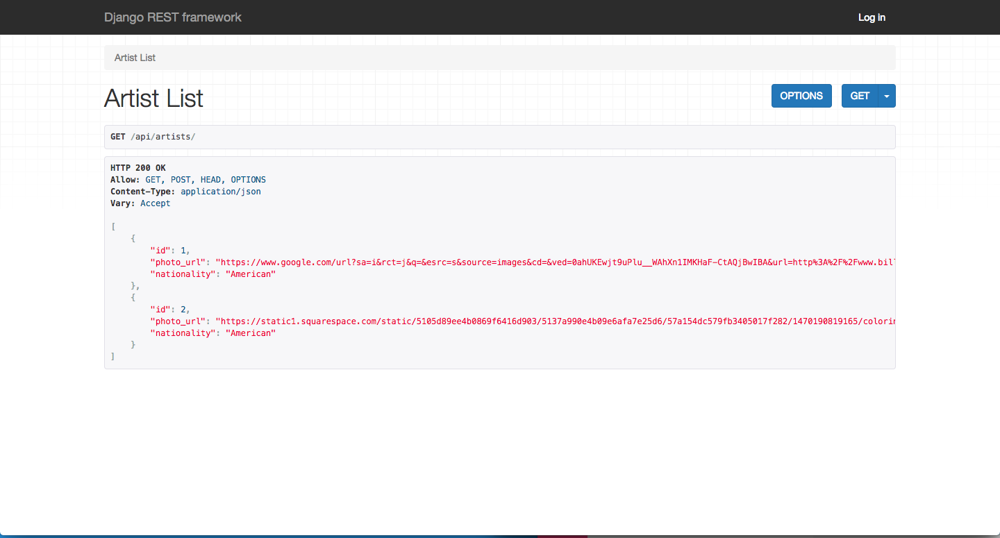

```bash
$ pip install djangorestframework
$ pip freeze > requirements.txt
```

settings.py
```python
INSTALLED_APPS = [
    ...
    'rest_framework',
]
```

urls.py
```python
    url(r'^api-auth/', include('rest_framework.urls', namespace='rest_framework'))
```

settings.py
```python
REST_FRAMEWORK = {
    # Use Django's standard `django.contrib.auth` permissions,
    # or allow read-only access for unauthenticated users.
    'DEFAULT_PERMISSION_CLASSES': [
        'rest_framework.permissions.DjangoModelPermissionsOrAnonReadOnly'
    ]
}
````

serializers.py
```py
from rest_framework import serializers
from .models import Artist

class ArtistSerializer(serializers.ModelSerializer):
    class Meta:
        model = Artist
        fields = ('id', 'photo_url', 'nationality', 'name',)
```

views.py
```py
from rest_framework import generics 
from .serializers import ArtistSerializer

class ArtistList(generics.ListCreateAPIView):
    queryset = Artist.objects.all()
    serializer_class = ArtistSerializer


class ArtistDetail(generics.RetrieveUpdateDestroyAPIView):
    queryset = Artist.objects.all()
    serializer_class = ArtistSerializer

```

tunr/urls.py
```py
from django.conf.urls import url

from rest_framework.routers import DefaultRouter

from . import views

urlpatterns = [
  url(r'artists/$', views.ArtistList.as_view()),
  url(r'artists/(?P<pk>[0-9]+)/$', views.ArtistDetail.as_view())
]
```



